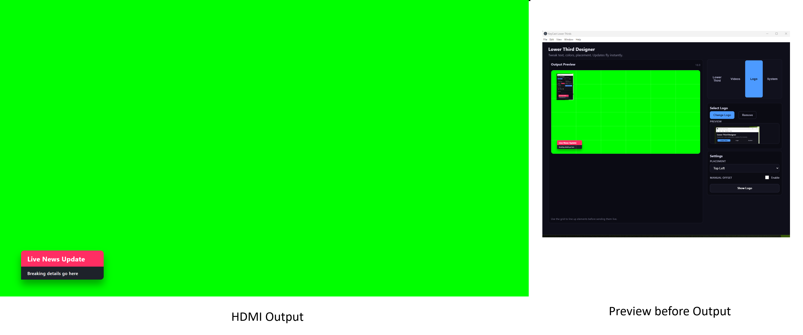
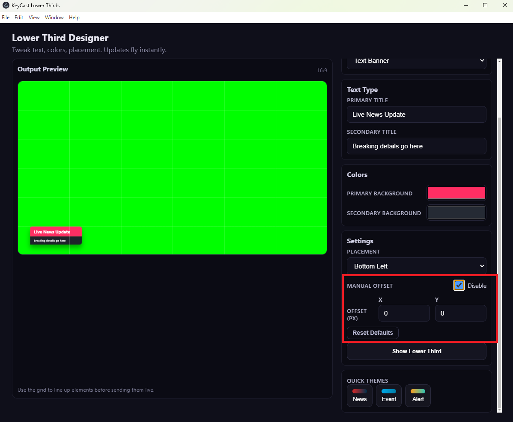
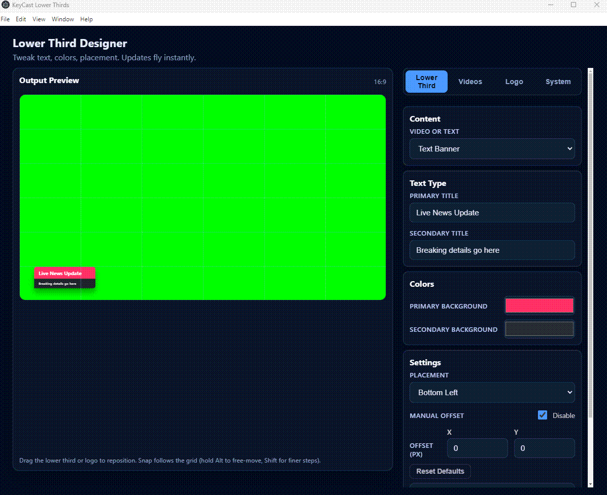
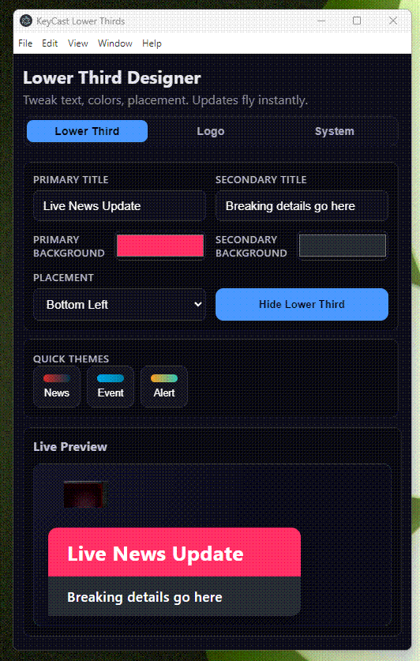
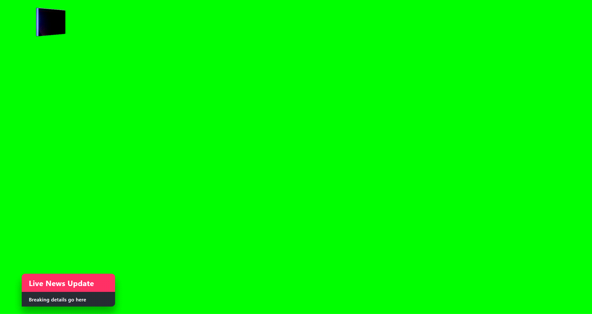
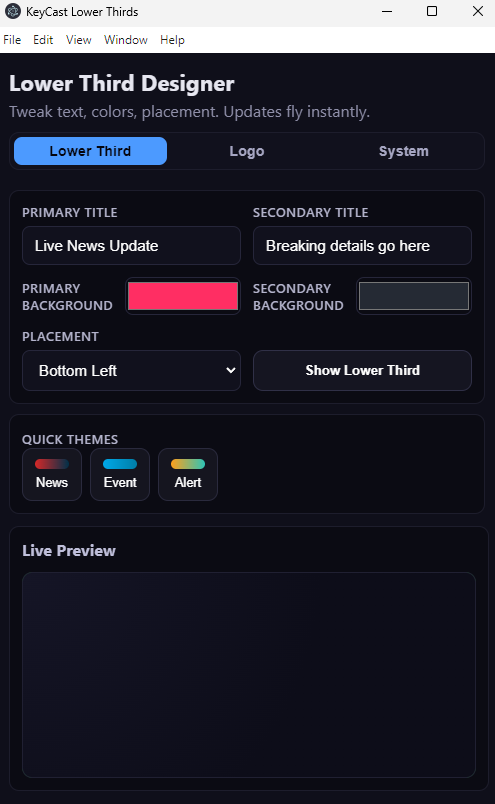
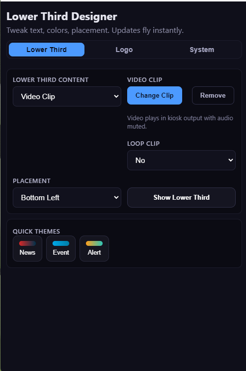
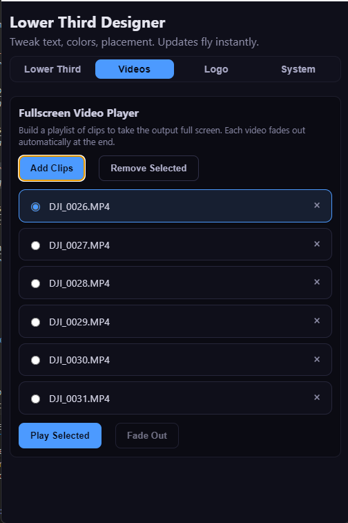
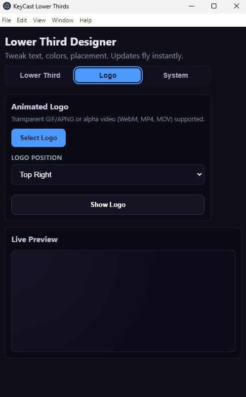
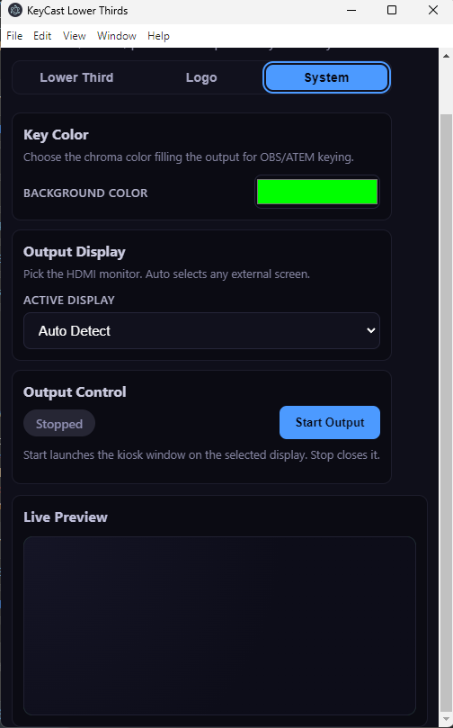

# KeyCast Lower Thirds

KeyCast Lower Thirds is an Electron + React control surface for driving broadcast-quality lower thirds with chroma or alpha workflows. It ships with an operator-friendly panel, a kiosk-ready HDMI output, and real-time sync between the two so you can focus on live production instead of fighting graphics software.

> **Why “KeyCast”?**  
> The app is designed to drop straight into OBS, vMix, ATEM, or any SDI/NDI pipeline—either as a keyed fill over a chroma background or as a stand-alone HDMI feed.

---

## ✨ Highlights

- **Dual-window architecture**: control UI on your desktop, fullscreen kiosk output on a designated monitor/HDMI port.
- **Instant updates**: text, colors, placement, visibility, and animated logos sync live—no reloads.
- **Chroma-ready background**: choose any key color (default neon green) for OBS/ATEM chroma workflows.
- **Output manager**: start/stop the kiosk window from the control panel and lock it to any detected display.
- **Flexible lower thirds**: switch between text banners and video clips, with optional loop control, without leaving the tab.
- **Fullscreen video cues**: build a playlist of stingers, pick one, press play, and it will fade out automatically at the end.
- **Animated logos**: loop or play-once alpha video (WebM/MP4/MOV) or transparent GIF/APNG overlays with positional controls.
- **Quick styling presets**: one-click News, Event, and Alert palettes to keep operators moving fast.

---

## 🚀 Quick Start

```bash
# Install dependencies
npm install

# Launch Vite + Electron in dev mode
npm run dev
```

The first window that appears is the **control panel**. Once you’re ready to output, open the **System → Output Control** tab and hit **Start Output**. The kiosk window will jump to the configured display and run in frameless, locked-down mode.

For production builds:

```bash
npm run package
```

Artifacts are generated via `electron-builder` inside `dist/`.

---

## 🖥️ Screens & Flows

> Replace the placeholder images below with captures from your environment. Suggested resolutions: 1600×900 for panels, 1920×1080 for kiosk output.


*Pre-show preview window with grid overlay for alignment.*


*Offset controls for fine-tuning logo and lower third placement.*


*Drag-to-snap workflow showing grid-aligned repositioning with live offset updates.*


*Tab navigation across Lower Third, Logo, and System sections with live preview.*


*Fullscreen HDMI render with neon-green background ready for chroma keying.*


*Two-column editor for primary/secondary titles, chroma palettes, placement, and visibility toggle.*


*Video-mode controls showing clip picker, loop toggle, and placement options for broadcast stingers.*


*Playlist view for full-frame videos with add/remove controls, play trigger, and live status badges.*


*Animated preview, loop controls, and hot-swap logo tooling.*


*Live Sources tab previewing a VDO.Ninja feed and its quick history list.*


*Key color picker, display routing, and kiosk lifecycle controls.*


---

## 🔧 Configuration Cheatsheet

### Lower Third Tab

- **Content type**: choose between a text-driven banner or a muted video clip.
- **Loop clip**: decide whether a selected video lower third repeats or runs once.
- **Primary / Secondary title**: supports emoji, RTL text, and quick clear.
- **Background colors**: per-line color pickers with hex entry; updates push straight to the output surface.
- **Placement**: top/bottom + left/right corners with animated transitions.
- **Logo video playback**: when a video logo is loaded, choose loop vs play-once directly from here.
- **Visibility toggle**: instantly fade lower third in/out without killing the kiosk.
- **Quick themes**: apply curated color sets for News, Event, and Alert packages.
- **History**: save the current lower third layout (text or video) and restore it later with one click.

### Videos Tab

- **Playlist builder**: add one or more full-frame clips (WebM/MP4/MOV/MKV) to drive show openers, sponsor spots, or bumpers.
- **Quick select**: highlight one clip at a time, see which one is live, and remove items you no longer need.
- **Single-click playback**: hit play and the chosen clip fills the output; it automatically fades down at the end.
- **Manual fade**: trigger an early fade out with a single button if you need to cut back sooner.

### Logo Tab

- **Accepted formats**: GIF, APNG, transparent PNG, WebM/MP4/MOV (muted by default).
- **Positioning**: all four corners; snapping to safe margins.
- **Show/Hide toggle**: operate independently of the text overlay.
- **Live preview**: scaled frame inside the control panel plus real kiosk render.

### Live Sources Tab

- **Add VDO.Ninja feeds**: paste a `https://vdo.ninja/?view=...` URL and label it for the show rundown.
- **Preview**: embed the viewer link in the control panel to confirm picture and audio before you take it live.
- **Take Live**: fades the kiosk to the selected feed and automatically hides fullscreen video cues.
  - **History**: keep a rolling list of previously used links so you can recall them instantly.

  ### System Tab
- **Key color**: pick the chroma background (defaults to `#00FF00`).  
  - For OBS, add a Window Capture → Chroma Key filter.  
  - For ATEM, feed the fill output and key out the chroma value, or use OBS/vMix as an upstream keyer.
- **Transparent mode**: press **Transparent for OBS** to render the kiosk with true alpha—perfect for Browser Sources.
- **Display routing**: target any connected monitor/HDMI/SDI adapter.
- **Output control**: start/stop the kiosk window, monitor status via pill indicator.

  
## Remote Screen Share Workflow

KeyCast now leans on VDO.Ninja for remote presenters.

1. Ask the remote guest to open **https://vdo.ninja** (or the invite link you generated) and start screen sharing or sending their program feed.
2. Copy the viewer link that ends with `?view=...` and paste it into the **Live Sources → Add Source** form.
3. Use the in-app preview to verify audio/video. When you press **Take Live**, the kiosk window switches to the feed and hides any fullscreen clips.
4. Any layout you remove is stored in history so you can bring it back with one click.
2. Copy the viewer link that ends with `?view=...` and paste it into the **Live Sources -> Add Source** form.
3. Use the in-app preview to verify audio/video. When you press **Take Live**, the kiosk window switches to the feed and hides any fullscreen clips.
4. Any layout you remove is stored in history so you can bring it back with one click.
- Append `&transparent=1&control=false` to viewer links for a cleaner, UI-free embed.
- Your control machine just needs outbound HTTPS to VDO.Ninja - no local signalling server required.
- Use the **Hide** button to fade back to your lower third bed while keeping the remote link handy.


### OBS Studio

1. `Start Output` inside KeyCast.
2. Add a **Window Capture** (or **Game Capture**) source targeting the kiosk window.
3. Apply a **Chroma Key** filter using the configured background color.
4. Layer above your camera input and lock placement.

For alpha workflows, you can embed the Vite dev server as a **Browser Source** (when packaged, serve the production build) and set `backgroundColor` to transparent instead of green. That requires a bit of customization—see “Extending” below.

### Blackmagic ATEM (Mini / Television Studio)

- If your capture card supports fill/key pairs, run KeyCast full-screen on a machine feeding both signals.
- Otherwise, key the chroma background using the upstream keyer; adjust the **clip** and **gain** to match your chosen color.
- Use the System tab to flip between auditorium screens, lobby signage, or dedicated keyer inputs.

---

## 🧩 Extending

| Area | Description | Hint |
| --- | --- | --- |
| Alpha Output | Render transparency instead of chroma fill. | Swap the kiosk background to transparent canvas and export via NDI/RTMP or Browser Source. |
| Themes | Add more quick presets for specific shows. | Update `presetThemes` in `ControlPanel.jsx`. |
| Shortcuts | Hook up Stream Deck / X-Keys triggers. | Wire to IPC events (`lowerThird:update`, `output:start`, etc.). |
| Automation | Drive from rundown or REST API. | Inject via `ipcMain.on("lowerThird:update")` or expose HTTP endpoints. |

---

## 🏗️ Architecture

- **Electron 31** powers the dual-window orchestration and IPC bridge.
- **React 18 + Vite 5** render the control panel and kiosk UI.
- **IPC messaging** keeps control → kiosk state synchronized in real time.
- **Context-isolated preload** restricts the renderer to safe, typed APIs.
- **Chroma workflow** uses standard HTML color input; all styling is pure CSS for easy theming.

---

## 📂 Project Structure

```
electron/
  main.js        # Electron lifecycle, window management, IPC handlers
  preload.js     # Secure bridge exposing allowed renderer APIs
src/
  App.jsx        # Mode switcher (control vs kiosk)
  components/
    ControlPanel.jsx
    DisplaySurface.jsx
    LowerThird.jsx
    AnimatedLogo.jsx
  styles.css     # Global styles + layout
```

Create a `docs/screens/` folder for the screenshots referenced above.

---

## 🛣️ Roadmap Ideas

- Alpha-channel NDI output.
- Custom font upload & font weight control.
- Timeline-based lower third playlists.
- Companion HTTP/OSC control layer.
- Automated mirror to web overlays for remote shows.

---

## 🤝 Contributing

1. Fork and clone the repository.
2. `npm install && npm run dev`.
3. Work in feature branches; send PRs with concise descriptions.
4. Attach screen recordings or GIFs when changing UI flows.

Bug reports and feature requests are welcome—open an issue with the `bug` or `enhancement` label.

---

## 📄 License

MIT © 2025 KeyCast Contributors. See [`LICENSE`](LICENSE) for details.

## Creator’s Note

This project started because I wanted to study how Japanese TV shows craft their animated overlays and how conferences layer live cameras, presentations, and titles together. KeyCast Lower Thirds is my sandbox for learning those broadcast techniques while building something others can use on their own productions. :)
